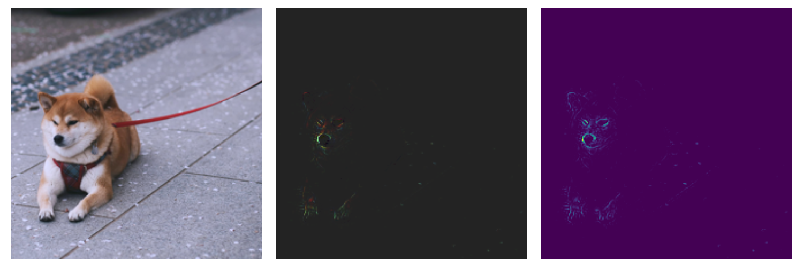

# FGVis
Unofficial PyTorch implementation of FGVis presented in the paper "[Interpretable and Fine-Grained Visual Explanations for Convolutional Neural Networks](https://openaccess.thecvf.com/content_CVPR_2019/papers/Wagner_Interpretable_and_Fine-Grained_Visual_Explanations_for_Convolutional_Neural_Networks_CVPR_2019_paper.pdf)" by Wagner et al. [CVPR 2019]. FGVis is a method to identify the pixels of an image that are relevant for a prediction.



Image by [Evgeny Tchebotarev](https://www.pexels.com/de-de/foto/shiba-inu-ruht-auf-dem-burgersteig-2187304/).

## Setup

Create a conda environment and install the requirements.

```
conda create -n fgvis python=3.10
conda activate fgvis
pip install torch torchvision --index-url https://download.pytorch.org/whl/cu121
pip install -e .
```

## Usage

The script supports all [timm](https://github.com/huggingface/pytorch-image-models) models. Different models may require different `mask_weight` and `learning_rate` parameters. 

```
python main.py -h
usage: main.py [-h] --image_path IMAGE_PATH [--model MODEL] [--max_iterations MAX_ITERATIONS] [--learning_rate LEARNING_RATE] [--mask_weight MASK_WEIGHT]

options:
  -h, --help            show this help message and exit
  --image_path IMAGE_PATH
                        Path to the input image.
  --model MODEL         Model name to use (Default: vgg16).
  --max_iterations MAX_ITERATIONS
                        Maximum number of iterations (Default: 500).
  --learning_rate LEARNING_RATE
                        Learning rate (Default: 0.1).
  --mask_weight MASK_WEIGHT
                        Mask weight (Default: -1e-9).
```